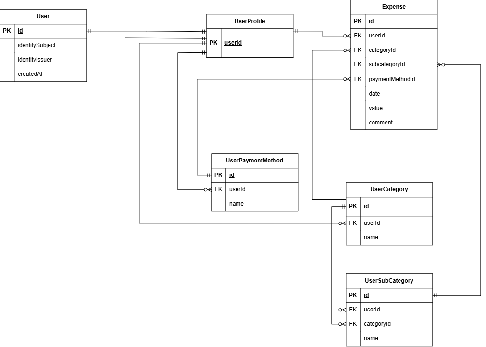

# Easy Expenses API

Easy Expenses is a REST API for tracking personal expenses. Users can configure their expense categories and payment methods, record expenses, and retrieve their expense history. The project is built with Java 25 and Spring Boot 4 and uses Keycloak for authentication, PostgreSQL for persistence, and Docker for local development.

## Tech Stack

**Java 25** · **Spring Boot 4** · **PostgreSQL 18** · **Keycloak** · **Docker** · **Flyway** · **Testcontainers** · **OpenAPI**

| Area              | Technology                          |
| ----------------- | ----------------------------------- |
| Language          | Java 25                             |
| Framework         | Spring Boot 4.0.5                   |
| Database          | PostgreSQL 18                       |
| Security          | Spring Security + OAuth2 + Keycloak |
| Persistence       | Spring Data JPA / Hibernate         |
| Migrations        | Flyway                              |
| Testing           | JUnit + Mockito + Testcontainers    |
| API Documentation | OpenAPI / Swagger UI                |
| Development       | Docker Compose + Maven              |


---

## Features

- **User profile setup** — configure payment methods and expense categories, including hierarchical subcategories. Currently, profile configuration is supported only once, during initial setup.
- **Profile retrieval** — retrieve the authenticated user's configured profile.
- **Expense creation** — record expenses using configured categories and payment methods, with an amount and optional comment.
- **Expense history** — retrieve previously recorded expenses.

## Future Features

- Profile modification and configuration versioning
- Weekly, monthly, and yearly expense aggregations
- Expense sorting and filtering
- Multicurrency support
- Expense forecasting

---

## Architecture

The application consists of three main components:

```text
                    ┌─────────────┐
                    │   Client    │
                    └──────┬──────┘
                           │
                           ▼
                 ┌──────────────────┐
                 │   Spring Boot    │
                 │       API        │
                 └───────┬──────────┘
                         │
              ┌──────────┴──────────┐
              │                     │
              ▼                     ▼
       ┌─────────────┐      ┌─────────────┐
       │  PostgreSQL │      │   Keycloak  │
       │   Database  │      │     Auth    │
       └─────────────┘      └─────────────┘
```

The Spring Boot application acts as an **OAuth2 Resource Server** and validates access tokens issued by Keycloak.

The application follows a layered architecture:

```text
Controller
    ↓
Service
    ↓
Repository
    ↓
Database
```

* **Controller** — exposes REST endpoints
* **Service** — contains business logic
* **Repository** — handles database access
* **Entity** — represents persistent data
* **DTO** — represents API requests and responses

---

## Database Schema

The database schema is represented by the following ERD:



The application uses **PostgreSQL** as its relational database.

Database schema changes are managed using **Flyway migrations**, allowing database structure to be version-controlled and automatically applied.

---

## Authentication

Authentication and authorization are handled by **Keycloak**.

The Spring Boot application is configured as an OAuth2 Resource Server and uses Keycloak as the token issuer.

```text
Client
   │
   │ Authentication
   ▼
Keycloak
   │
   │ JWT Access Token
   ▼
Spring Boot API
   │
   │ Token validation
   ▼
Protected Resources
```

Keycloak configuration is imported automatically when the Docker Compose environment starts.

---

## API

### Endpoints

The REST API is versioned under `/api/v1`.

#### User Profile

| Method | Endpoint     | Description                          |
| ------ | ------------ | ------------------------------------ |
| `GET`  | `/api/v1/me` | Get the authenticated user's profile |
| `POST` | `/api/v1/me` | Save the user's configuration        |

#### Expenses

| Method | Endpoint           | Description       |
| ------ | ------------------ | ----------------- |
| `GET`  | `/api/v1/expenses` | Get expenses      |
| `POST` | `/api/v1/expenses` | Add a new expense |

### API Documentation

* **Swagger UI:** `http://localhost:8081/swagger-ui/index.html`
* **OpenAPI:** `http://localhost:8081/api-docs`
* **Bruno:** API request collection available in the `bruno/` directory.

---


## Docker

The complete development environment can be started using Docker Compose.

The environment consists of:

| Service    | Description                    |   Port |
| ---------- | ------------------------------ | -----: |
| `app`      | Spring Boot REST API           | `8081` |
| `keycloak` | Authentication & authorization | `8080` |
| `postgres` | PostgreSQL database            | `5432` |

The Spring Boot application runs on port `8080` inside the container and is exposed on port `8081` on the host.

PostgreSQL includes a health check, and the application waits for the database to become healthy before starting.

---

## Getting Started

### Requirements

* Docker
* Docker Compose

### Configuration

Create a `.env` file in the project root.

Example:

```env
SPRING_PROFILES_ACTIVE=dev

KEYCLOAK_ISSUER_URI=http://keycloak:8080/realms/<realm>
KEYCLOAK_AUDIENCE=<audience>

POSTGRES_HOST=postgres
POSTGRES_PORT=5432
POSTGRES_DB=easy_expenses
POSTGRES_USERNAME=postgres
POSTGRES_PASSWORD=postgres

KEYCLOAK_ADMIN_USERNAME=admin
KEYCLOAK_ADMIN_PASSWORD=admin
```

### Start the application

```bash
docker compose up --build
```

This starts:

1. PostgreSQL
2. Keycloak
3. Spring Boot application

### Stop the application

```bash
docker compose down
```

To remove the PostgreSQL volume as well:

```bash
docker compose down -v
```

---

## Testing

The project uses **Testcontainers** for integration testing.

PostgreSQL can be started automatically in a container during tests, providing an isolated database environment.

Before running the tests, configure the required environment variables in the IntelliJ IDEA Run/Debug Configuration.

Run the test suite with:

```bash
./mvnw test
```

---

## Project Structure

```text
easy-expenses-api/
├── bruno/
├── docs/
├── keycloak/
│   └── import/
├── src/
│   ├── main/
│   │   ├── java/
│   │   └── resources/
│   └── test/
├── .env
├── Dockerfile
├── docker-compose.yml
├── pom.xml
└── README.md
```

---

## Database Migrations

Database schema changes are managed using **Flyway**.

Migrations are version-controlled and executed automatically when the application starts.

Example:

```text
src/main/resources/db/migration/
├── V1__initial_schema.sql
├── V2__...
└── V3__...
```

---

## License

This project is for educational and portfolio purposes.
